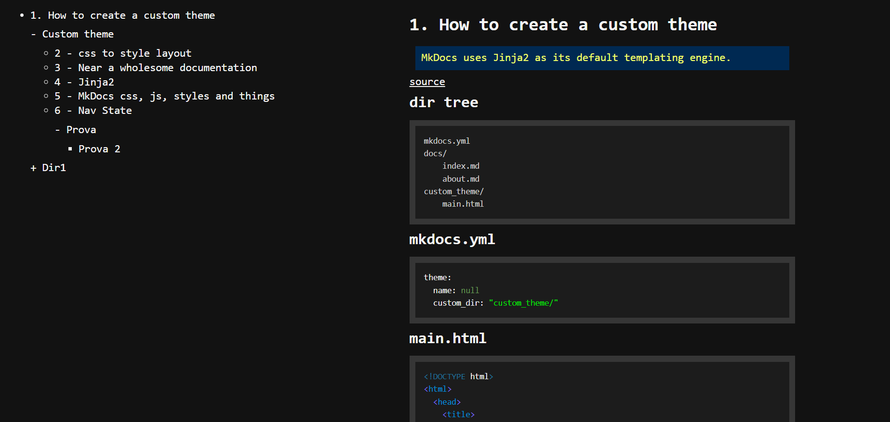

# dark_minimal_dirtree

## Example



## links

- [python repo](https://pypi.org/project/mkdocs-dark-minimal-dirtree/)
- [github](https://github.com/Jakkins/dark_minimal_dirtree)

## installation

```bash
pip install mkdocs-dark-minimal-dirtree
python -m mkdocs new proj1
code proj1/
nano mkdocs.yml
```

```yml
site_name: My Docs
theme:
  name: dark_minimal_dirtree
```

```bash
python -m mkdocs serve
```

## How it works

Everything that contains a markdown file inside the `docs` directory is listed in the navigation menu on the left.
The order is by filename and not by title.
This is good because you can name every file like:

- index.md
- 000.md
- dir1
  - 000.md
  - 001.md

But you can always change title as you want:

- index.md (Home)
- 000.md (part1)
- dir1
  - 000.md (part2)
  - 001.md (part3)

Resulting in:

- Home
- part1
- dir1 (**this is collapsable**)
  - part2
  - part3

## How to customize this theme

1. Go [here](https://pypi.org/project/mkdocs-dark-minimal-dirtree/#files) and download the .tar.gz file
2. Create a new project with `python -m mkdocs new proj`
3. Extract `dark_minimal_dirtree` inside the project:

   ```txt
   docs
   	index.md
   mkdocs.yml
   dark_minimal_dirtree
   ```

4. Edit the `mkdocs.yml` file

   ```yaml
   site_name: My Docs
   theme:
   	name: null
   	custom_dir: dark_minimal_dirtree
   ```
